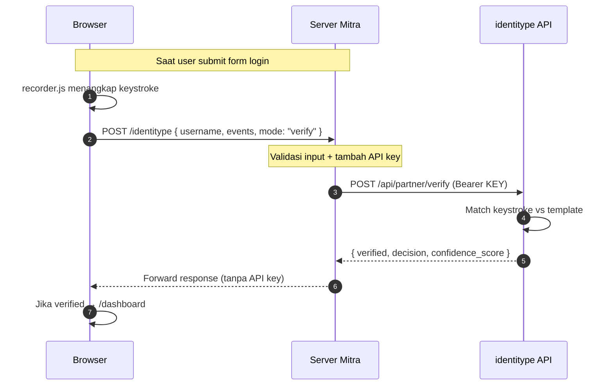

# identitype — Partner Integration Guide

Panduan integrasi API identitype ke website mitra. Setiap langkah menjelaskan
**file mana yang dibuat** dan **isinya apa**.

> **Untuk siapa:** developer mitra yang baru pertama kali integrasi.
> **Target waktu:** panggilan API pertama dalam 5 menit, integrasi lengkap dalam ~2 jam.

---

## TL;DR

**identitype** adalah layanan **keystroke biometrics** — selain password, sistem memverifikasi *ritme ketikan* user. User butuh **enroll** (latih model) sebelum bisa **verify** (autentikasi). Semua call ke API harus lewat **server mitra** (proxy), tidak langsung dari browser, karena ada API key.

---

## 1. Quickstart cURL (5 menit)

Buktikan koneksi ke API jalan sebelum tulis kode apa pun.

```bash
curl -X POST https://identitype.duckdns.org/api/partner/enroll \
  -H "Authorization: Bearer <YOUR_API_KEY>" \
  -H "Content-Type: application/json" \
  -d '{
    "username": "test-user-1",
    "events": [
      {"evt":"d","key":"a","code":"KeyA","t":0},
      {"evt":"u","key":"a","code":"KeyA","t":85},
      {"evt":"d","key":"b","code":"KeyB","t":210},
      {"evt":"u","key":"b","code":"KeyB","t":295}
    ]
  }'
```

**Yang harus dapat:**

| Response | Artinya | Aksi |
|---|---|---|
| `{"success": true, ...}` | Koneksi + key valid | Lanjut ke Section 2 |
| `401 Unauthorized` | API key salah / di-revoke | Cek dengan tim identitype |
| `404 Not Found` | URL salah | Pastikan path = `.../api/partner` |
| `INVALID_KEYSTROKE_DATA` | Sample terlalu pendek | OK juga — auth jalan, sample ditolak normal |
| Timeout / connection refused | Server tidak terjangkau | Cek firewall / VPN |

---

## 2. Arsitektur



| Lapisan | Tugas |
|---|---|
| Browser | Merekam keystroke event + submit ke proxy mitra |
| Server Mitra | Validasi + sisipkan API key + forward ke identitype |
| identitype API | Train (enroll) atau verifikasi (verify) ritme ketikan |

---

## 3. Struktur File Project

Yang harus Anda buat (atau adopsi dari simulasi ini):

```
project-anda/
├── main.py                            ← entry point Flask
├── requirements.txt                   ← dependency Python
├── .env                               ← secret (gitignored)
├── .env.example                       ← template .env
└── website/
    ├── __init__.py                    ← Flask app factory
    ├── identitype.py                  ← klien HTTP ke identitype  ★ kunci
    ├── views.py                       ← /identitype proxy + page routes  ★ kunci
    ├── auth.py                        ← /api/login, /api/sign-up, /api/verify-password
    ├── models.py                      ← User model (email, password, UUID)
    ├── static/
    │   ├── recorder.js                ← drop-in keystroke recorder  ★ kunci
    │   ├── index.js                   ← frontend logic
    │   ├── style.css
    │   └── toast.js, toast.css
    └── templates/
        ├── base.html
        ├── home.html
        ├── sign_up.html
        ├── typing_patterns.html       ← form enrollment  ★ kunci
        ├── login.html                 ← form login dengan keystroke
        └── dashboard.html
```

File bertanda ★ adalah inti integrasi identitype. Yang lain sudah Anda punya kalau aplikasi Anda sudah jalan.

---

## 4. Dua Jalur: Dari Nol vs Dari Aplikasi yang Sudah Ada

Pilih jalur sesuai posisi Anda:

### Jalur A — Saya belum punya aplikasi sama sekali

Lanjut ke **§5 Implementasi Step-by-Step**. Bangun semuanya dari nol mengikuti Step 1–12.

### Jalur B — Saya sudah punya Flask app dengan login/sign-up biasa (seperti branch `vanilla`)

**Untuk tutorial lengkap step-by-step, lihat dokumen terpisah:**
👉 **[UPGRADE_FROM_VANILLA.md](./UPGRADE_FROM_VANILLA.md)**

Dokumen tersebut berisi tutorial 13-step yang men-trace persis apa yang
harus dilakukan, dengan setiap file ditulis lengkap (siap copy-paste).
Target waktu: ~45 menit dari vanilla → identitype-enabled.

Ringkasannya di bawah ini, untuk overview cepat:

Anda hanya perlu **menambah delta keystroke** ke aplikasi existing. Berikut tepatnya apa yang harus ditambah / diubah.

#### File yang BARU (tambah dari nol)

| File | Dari mana copy | Fungsi |
|---|---|---|
| `website/identitype.py` | Step 5 di §5 (atau [website/identitype.py](../website/identitype.py)) | HTTP client ke identitype |
| `website/static/recorder.js` | [website/static/recorder.js](../website/static/recorder.js) | Drop-in keystroke recorder, **copy apa adanya** |
| `website/templates/typing_patterns.html` | Step 10 di §5 | Form enrollment |

#### File yang EXISTING tapi harus DIUBAH

| File | Yang ditambah | Lihat |
|---|---|---|
| `requirements.txt` | (tidak perlu — dependency baru tidak ada selain yang sudah ada) | — |
| `.env.example` + `.env` | Tambah 3 baris: `IDENTITYPE_BASE_URL`, `IDENTITYPE_API_KEY`, `IDENTITYPE_TIMEOUT_SECONDS` | Step 2 |
| `website/models.py` | Tambah kolom UUID di model User (mis. `identitype_uid`) | Step 7 |
| `website/auth.py` | Tambah endpoint `/api/verify-password` | Step 8 |
| `website/views.py` | Tambah route `/identitype` (proxy) + route halaman `/typing-patterns` | Step 6 |
| `website/static/index.js` | Tambah keystroke recording untuk form login + form enrollment | Step 11 |
| `website/templates/sign_up.html` | Ubah redirect setelah sign-up: ke `/typing-patterns` (bukan `/login`) | Step 10 |
| `website/templates/login.html` | (tidak perlu ubah HTML — index.js yang mendeteksi form-nya) | — |
| `website/templates/base.html` | Pastikan `<script type="module" src=".../index.js">` (kalau belum module type, harus diganti) | Step 10 |

#### Database

Setelah menambah kolom `identitype_uid` di `models.py`, hapus `instance/database.db` (kalau ada) lalu restart Flask — schema akan dibuat ulang dengan kolom baru. Akun existing akan hilang; kalau perlu di-preserve, lakukan migrasi via Flask-Migrate / Alembic.

#### Verifikasi konkret: diff antara branch `vanilla` dan `main`

Kalau Anda kerja dengan repo simulasi ini, perintah ini menunjukkan diff lengkap apa yang ditambah `main` ke `vanilla`:

```bash
git diff vanilla main -- website/ requirements.txt .env.example
```

Atau lihat per-file:

```bash
git diff vanilla main -- website/auth.py        # diff auth endpoint
git diff vanilla main -- website/views.py       # diff routes
git diff vanilla main -- website/models.py      # diff DB schema
git diff vanilla main -- website/static/index.js   # diff frontend
```

Output git diff inilah blueprint paling akurat dari "apa yang harus ditambah" — lebih akurat daripada deskripsi di tabel ini, karena selalu sinkron dengan code.

#### Ringkasan: 3 file baru + 5 file modifikasi + 1 schema change

Setelah delta di atas selesai dan `IDENTITYPE_API_KEY` di-set di `.env`, restart Flask. Flow keystroke akan langsung jalan.

---

## 5. Implementasi Step-by-Step

Section ini untuk **Jalur A** (dari nol). Kalau Anda di Jalur B, gunakan ini sebagai referensi isi tiap file yang disebut di tabel §4.

Tiap step menjelaskan: **file apa**, **letak di mana**, **isinya apa**.

### Step 1 — Install dependency

`requirements.txt`:

```
flask
Flask-SQLAlchemy
Flask-Login
python-dotenv
```

Install:

```bash
python -m venv .venv
.venv\Scripts\activate          # PowerShell
pip install -r requirements.txt
```

---

### Step 2 — Buat `.env.example` dan `.env`

**File `.env.example`** (boleh commit):

```bash
IDENTITYPE_BASE_URL=https://identitype.duckdns.org/api/partner
IDENTITYPE_API_KEY=<your-identitype-api-key>
IDENTITYPE_TIMEOUT_SECONDS=30
FLASK_SECRET_KEY=replace_me_with_a_long_random_string
FLASK_DEBUG=0
```

**File `.env`** (JANGAN commit — tambah ke `.gitignore`):

Copy dari `.env.example`, isi `IDENTITYPE_API_KEY` dengan key asli dari dashboard identitype, dan generate `FLASK_SECRET_KEY` dengan:

```bash
python -c "import secrets; print(secrets.token_urlsafe(32))"
```

---

### Step 3 — `main.py` (entry point)

**File `main.py`** (di root project):

```python
import os
from dotenv import load_dotenv
load_dotenv()  # MUST run before importing website (env dibaca saat import)

from website import create_app
app = create_app()

if __name__ == "__main__":
    debug = os.getenv("FLASK_DEBUG", "0") == "1"
    port = int(os.getenv("PORT", "5000"))
    app.run(host="127.0.0.1", port=port, debug=debug)
```

---

### Step 4 — `website/__init__.py` (Flask app factory)

**File `website/__init__.py`**:

```python
import os
from flask import Flask
from flask_sqlalchemy import SQLAlchemy

db = SQLAlchemy()

def create_app():
    app = Flask(__name__)
    app.config["SECRET_KEY"] = os.getenv("FLASK_SECRET_KEY", "dev")
    app.config["SQLALCHEMY_DATABASE_URI"] = "sqlite:///database.db"
    db.init_app(app)

    # Register blueprint — ini yang membuat /identitype route aktif
    from .views import views
    from .auth import auth
    app.register_blueprint(views, url_prefix="/")
    app.register_blueprint(auth, url_prefix="/")

    from .models import User
    with app.app_context():
        db.create_all()

    return app
```

> **Inti yang penting:** `register_blueprint(views)` membuat endpoint `/identitype` (yang akan dibuat di Step 6) bisa di-call dari browser.

---

### Step 5 — `website/identitype.py` ★ (klien HTTP ke identitype)

Ini file inti integrasi. Sediakan **dua versi** — pilih sesuai kebutuhan:

#### Versi Minimum (untuk PoC / demo)

**File `website/identitype.py`** — ~30 baris, hanya happy path + handling error dasar:

```python
import json
import os
import urllib.request, urllib.error

BASE_URL = os.getenv("IDENTITYPE_BASE_URL")
API_KEY  = os.getenv("IDENTITYPE_API_KEY")

def _post(endpoint, payload):
    req = urllib.request.Request(
        f"{BASE_URL}/{endpoint}",
        data=json.dumps(payload).encode("utf-8"),
        method="POST",
        headers={
            "Authorization": f"Bearer {API_KEY}",
            "Content-Type": "application/json",
        },
    )
    try:
        with urllib.request.urlopen(req, timeout=30) as res:
            return json.loads(res.read())
    except urllib.error.HTTPError as e:
        body = json.loads(e.read() or b"{}")
        body["http_status"] = e.code
        return body
    except Exception:
        return {"success": False, "error_code": "SERVICE_UNAVAILABLE"}

def send_typing_data(username, events, mode="verify"):
    payload = {"username": username, "events": events}
    return {mode: _post(mode, payload)}
```

#### Versi Production (untuk go-live)

Pakai file lengkap dari simulasi: [website/identitype.py](../website/identitype.py).

**Perbedaan dengan versi minimum:**

| Fitur | Minimum | Production |
|---|---|---|
| Konfigurasi timeout dari env | ❌ hardcode 30s | ✅ `IDENTITYPE_TIMEOUT_SECONDS` |
| Logging metadata (mode, count, decision) | ❌ tidak ada | ✅ via `logging` |
| Sanitasi error 5xx ke generic message | ❌ teruskan apa adanya | ✅ jangan bocor stack trace |
| Penanganan timeout terpisah dari URLError | ❌ semua dianggap unavailable | ✅ pesan beda |
| Redact API key di log | ❌ tidak relevan (tidak log) | ✅ `_redact_key()` |
| Warning saat BASE_URL plain HTTP | ❌ | ✅ |
| Warning saat API_KEY kosong | ❌ | ✅ |

**Aturannya sederhana:** untuk demo/skripsi, versi minimum cukup. Untuk production, **wajib** pakai versi lengkap karena handling error yang bocor detail infrastruktur ke client = security issue.

---

### Step 6 — `website/views.py` ★ (endpoint proxy `/identitype`)

**File `website/views.py`** — endpoint yang dipanggil browser. Browser tidak boleh punya API key, jadi browser kirim ke sini, kita yang panggil identitype.

```python
from flask import Blueprint, request, jsonify, render_template
from .identitype import send_typing_data

views = Blueprint("views", __name__)

# Halaman-halaman
@views.route("/")
def home():
    return render_template("home.html")

@views.route("/typing-patterns")
def typing_patterns():
    return render_template("typing_patterns.html")

@views.route("/dashboard")
def dashboard():
    return render_template("dashboard.html")

# Proxy ke identitype API ★
@views.route("/identitype", methods=["POST"])
def identitype_proxy():
    data = request.get_json() or {}
    username = data.get("username")
    events   = data.get("events")
    mode     = data.get("mode", "verify")

    # Validasi input dasar
    if not username or not isinstance(events, list) or not events:
        return jsonify({"error": "Bad request"}), 400
    if mode not in ("enroll", "verify"):
        return jsonify({"error": "mode must be enroll or verify"}), 400

    response = send_typing_data(username, events, mode=mode)
    upstream = response.get(mode, {})
    status = 200 if upstream.get("success") else 400
    return jsonify(response), status
```

> **Inti:** route `/identitype` ini yang dipanggil JavaScript di browser. Karena `Blueprint("views")` sudah di-register di `__init__.py` Step 4, endpoint langsung aktif begitu Flask jalan.

---

### Step 7 — `website/models.py` (database)

**File `website/models.py`** — User table dengan UUID untuk dikirim ke identitype sebagai `username`.

```python
import uuid
from flask_login import UserMixin
from . import db

class User(db.Model, UserMixin):
    id = db.Column(db.Integer, primary_key=True)
    email = db.Column(db.String(150), unique=True)
    password = db.Column(db.String(150))   # akan di-hash
    # UUID yang dikirim ke identitype sebagai `username` (bukan email — privacy)
    identitype_uid = db.Column(db.String(100), default=lambda: str(uuid.uuid4()))
```

---

### Step 8 — `website/auth.py` (login, sign-up, verify-password)

**File `website/auth.py`** — tiga endpoint JSON yang dipanggil frontend.

```python
from flask import Blueprint, request, jsonify, render_template, make_response
from werkzeug.security import generate_password_hash, check_password_hash
from . import db
from .models import User

auth = Blueprint("auth", __name__)

# JSON endpoints
@auth.route("/api/sign-up", methods=["POST"])
def api_sign_up():
    data = request.get_json() or {}
    email, password = data.get("email"), data.get("password")
    if User.query.filter_by(email=email).first():
        return jsonify({"message": "Email is already used"}), 409
    user = User(email=email, password=generate_password_hash(password))
    db.session.add(user); db.session.commit()
    return jsonify({"message": "Created", "user_id": user.identitype_uid}), 201

@auth.route("/api/login", methods=["POST"])
def api_login():
    data = request.get_json() or {}
    user = User.query.filter_by(email=data.get("email")).first()
    if not user or not check_password_hash(user.password, data.get("password", "")):
        return jsonify({"message": "Invalid email or password"}), 401
    return jsonify({"message": "OK", "user_id": user.identitype_uid}), 200

# Penting untuk enrollment: pastikan password yang diketik saat enroll
# COCOK dengan password akun. Kalau tidak, model dilatih dengan ritme
# password yang salah → saat login asli, dianggap impostor.
@auth.route("/api/verify-password", methods=["POST"])
def api_verify_password():
    data = request.get_json() or {}
    user = User.query.filter_by(identitype_uid=data.get("user_id")).first()
    if not user or not check_password_hash(user.password, data.get("password", "")):
        return jsonify({"match": False, "message": "Password tidak cocok"}), 401
    return jsonify({"match": True}), 200

# Page routes
@auth.route("/login")
def login(): return render_template("login.html")

@auth.route("/sign-up")
def sign_up(): return render_template("sign_up.html")
```

---

### Step 9 — `website/static/recorder.js` ★ (perekam keystroke)

**Copy file ini apa adanya** dari simulasi: [website/static/recorder.js](../website/static/recorder.js).

Library vanilla JS, tidak butuh dependency apa pun. Tidak perlu modifikasi.

**Cara import-nya di JavaScript Anda:**

```javascript
import { Keystroke } from "./recorder.js";
const recorder = new Keystroke();
recorder.addTarget("password");   // HANYA rekam field bernama 'password'
```

> ⚠️ **Penting:** `addTarget("password")` HARUS sama antara halaman enroll dan login. Kalau enroll merekam `"password"` saja, login juga hanya boleh `"password"`. Beda target → keystroke pattern beda → model selalu reject.

---

### Step 10 — HTML Templates

#### `website/templates/home.html`

```html

identitype — Home

<h2>identitype</h2>
<p>Keystroke-dynamics authentication demo. Sistem mengenali Anda dari ritme ketikan, bukan hanya dari password.</p>

<ul>
  <li><a href="/typing-patterns">Enroll typing pattern</a> — latih model dari ritme ketikan Anda.</li>
  <li><a href="/dashboard">Dashboard</a> — lihat hasil verifikasi.</li>
  <li><a href="/login">Login</a></li>
  <li><a href="/sign-up">Sign up</a></li>
</ul>

```

#### `website/templates/base.html`

Semua page lain `extends` ini. Berisi `<script>` import untuk `index.js` dan toast.

```html
<!DOCTYPE html>
<html>
<head>
  <meta charset="utf-8" />
  <title>identitype</title>
  <link rel="stylesheet" href="{{ url_for('static', filename='style.css') }}" />
  <link rel="stylesheet" href="{{ url_for('static', filename='toast.css') }}" />
</head>
<body>
  <nav>
    <a href="/">Home</a>
    <a href="/login">Login</a>
    <a href="/sign-up">Sign up</a>
  </nav>

  <div id="toast-container"></div>

  <main></main>

  <!-- Toast helper (untuk notify()) -->
  <script src="{{ url_for('static', filename='toast.js') }}"></script>
  <!-- Logic utama — type="module" wajib karena import recorder.js -->
  <script type="module" src="{{ url_for('static', filename='index.js') }}"></script>
</body>
</html>
```

> **Inti:** `<script type="module" src="…/index.js">` membuat JS bisa `import { Keystroke } from "./recorder.js"`. Tanpa `type="module"`, import-nya tidak jalan.

#### `website/templates/sign_up.html`

```html

Sign up

<h2>Create account</h2>
<form id="sign-up-form">
  <input type="email" id="email" name="email" placeholder="Email" />
  <input type="password" id="password" name="password" placeholder="Password" />
  <button type="submit">Create account</button>
</form>

```

> ID `sign-up-form`, `email`, `password` HARUS sesuai — index.js mencari elemen lewat ID ini.

#### `website/templates/typing_patterns.html` ★ (form enrollment)

**Inilah halaman yang dipakai user untuk melatih model ritme ketikan.**

```html

Enroll typing pattern

<h2>Enroll your typing pattern</h2>
<p>Type your password naturally. Server akan melatih model dari ritme ketikan Anda.</p>

<form id="typing-patterns-form">
  <input type="password"
         id="password"
         name="password"
         placeholder="Type your password"
         autofocus />
  <button type="submit">Submit sample</button>
</form>

<p>
  Progress akan ditampilkan via toast setelah submit (mis. "2/10 saved").
  Ulangi sampai semua sample tersimpan.
</p>

```

> **Yang penting:**
> - Form ID = `typing-patterns-form` → index.js mencari ini
> - Password input ID = `password` → `recorder.addTarget("password")` mencari ini
> - `autofocus` membantu UX — user langsung ketik tanpa klik

#### `website/templates/login.html`

```html

Login

<h2>Sign in</h2>
<form id="login-form">
  <input type="email" id="email" name="email" placeholder="Email" />
  <input type="password" id="password" name="password" placeholder="Password" />
  <button type="submit">Continue</button>
</form>

```

#### `website/templates/dashboard.html`

```html

Dashboard

<h1 id="greeting">Hello.</h1>
<p>Anda berhasil login.</p>
<a href="/login">Sign out</a>

<script>
  const email = sessionStorage.getItem("user_email");
  if (email) document.getElementById("greeting").textContent = "Hello, " + email + ".";
</script>

```

---

### Step 11 — `website/static/index.js` (frontend logic)

Ini yang **menghubungkan form HTML ↔ endpoint backend**. Browser load `base.html` → `base.html` load `index.js` → `index.js` deteksi form mana yang aktif di page → pasang listener.

**File `website/static/index.js`**:

```javascript
import { Keystroke } from "./recorder.js";

const recorder = new Keystroke();

// Helper notifikasi (pakai toast.js, bukan alert popup)
function notify(message, type = "info") {
  if (window.toast) window.toast[type](message);
  else console.log(message);
}

// ─── Pasang listener berdasarkan form yang ada di page ───

const signUpForm = document.getElementById("sign-up-form");
if (signUpForm) {
  signUpForm.addEventListener("submit", (e) => {
    e.preventDefault();
    handleSignUp();
  });
}

const loginForm = document.getElementById("login-form");
if (loginForm) {
  recorder.addTarget("password");   // ⚠️ HARUS sama dengan enrollment
  loginForm.addEventListener("submit", (e) => {
    e.preventDefault();
    handleLogin();
  });
}

const enrollForm = document.getElementById("typing-patterns-form");
if (enrollForm) {
  recorder.addTarget("password");   // ⚠️ HARUS sama dengan login
  enrollForm.addEventListener("submit", (e) => {
    e.preventDefault();
    handleEnroll();
  });
}

// ─── Handler ───

async function handleSignUp() {
  const email = document.getElementById("email").value;
  const password = document.getElementById("password").value;
  const res = await fetch("/api/sign-up", {
    method: "POST",
    headers: { "Content-Type": "application/json" },
    body: JSON.stringify({ email, password }),
  }).then(r => r.json());

  if (res.user_id) {
    sessionStorage.setItem("user_id", res.user_id);
    sessionStorage.setItem("user_email", email);
    notify("Account created. Now enroll your typing pattern.", "success");
    setTimeout(() => (window.location.href = "/typing-patterns"), 800);
  } else {
    notify(res.message, "error");
  }
}

async function handleLogin() {
  const email = document.getElementById("email").value;
  const password = document.getElementById("password").value;

  // Step 1: password check
  const loginRes = await fetch("/api/login", {
    method: "POST",
    headers: { "Content-Type": "application/json" },
    body: JSON.stringify({ email, password }),
  }).then(r => r.json());

  if (!loginRes.user_id) {
    notify(loginRes.message, "error");
    return;
  }

  sessionStorage.setItem("user_email", email);

  // Step 2: verify keystroke pattern
  const events = recorder.getEvents();
  recorder.reset();

  const verifyRes = await fetch("/identitype", {
    method: "POST",
    headers: { "Content-Type": "application/json" },
    body: JSON.stringify({
      username: loginRes.user_id,
      events,
      mode: "verify",
    }),
  }).then(r => r.json());

  const data = verifyRes.verify || {};
  if (data.success && data.verified && data.decision === "genuine") {
    window.location.href = "/dashboard";
  } else {
    notify("Pola ketikan tidak cocok.", "error");
  }
}

async function handleEnroll() {
  const password = document.getElementById("password").value;
  const userId = sessionStorage.getItem("user_id");
  if (!userId) {
    notify("Sign up dulu sebelum enroll.", "warning");
    return;
  }

  // Validasi password = password akun (cegah model dilatih dengan password salah)
  const check = await fetch("/api/verify-password", {
    method: "POST",
    headers: { "Content-Type": "application/json" },
    body: JSON.stringify({ user_id: userId, password }),
  }).then(r => r.json());

  if (!check.match) {
    notify("Password tidak cocok dengan yang Anda daftarkan.", "error");
    return;
  }

  // Kirim keystroke
  const events = recorder.getEvents();
  recorder.reset();

  const res = await fetch("/identitype", {
    method: "POST",
    headers: { "Content-Type": "application/json" },
    body: JSON.stringify({ username: userId, events, mode: "enroll" }),
  }).then(r => r.json());

  const data = res.enroll || {};
  if (data.success) {
    // Baca progress dari response (jangan hardcode angka)
    const current = data.progress?.current ?? data.templates_count;
    const target  = data.progress?.target  ?? data.required_templates;

    if (current >= target) {
      notify(`Enrollment selesai (${current}/${target}).`, "success");
      setTimeout(() => (window.location.href = "/login"), 1000);
    } else {
      notify(`Sample ${current}/${target} saved. Lanjut sample berikutnya.`, "info");
      setTimeout(() => window.location.reload(), 1000);
    }
  } else {
    notify(data.message || "Enroll gagal.", "error");
  }
}
```

---

### Step 12 — Jalankan & Test

```bash
python main.py
```

Buka `http://127.0.0.1:5000` di browser.

**Flow yang harus berhasil:**

1. **Home → Sign Up** — buat akun (mis. `test@test.com` / `Password123`)
2. Redirect ke `/typing-patterns`
3. **Enroll** — ketik password yang sama, submit. Toast: `"Sample 1/10 saved"`. Page reload otomatis.
4. Ulangi sampai 10/10. Toast: `"Enrollment selesai"`. Redirect ke `/login`.
5. **Login** — masukkan email + password. Toast: `"Pola ketikan cocok"`. Redirect ke `/dashboard`.
6. Dashboard menampilkan `"Hello, test@test.com."`

Kalau ada step gagal, lihat **§8 Stuck?** di bawah.

---

## 6. Production Hardening Checklist

| Area | Item |
|---|---|
| **Secrets** | API key di env var, `.env` di `.gitignore` |
| **Transport** | HTTPS di browser↔mitra DAN mitra↔identitype |
| **Logging** | Hanya metadata (mode, count, decision). Tidak pernah log payload (berisi password chars) |
| **Auth** | `username` di proxy ambil dari **session server-side**, jangan dari body request |
| **Validasi** | Schema check `events` (array, max ~1000 events, max body ~256KB) |
| **Rate limit** | Per-user di sisi mitra (5 verify/menit) berlapis dengan rate limit identitype |
| **Lockout** | Setelah N gagal verify berturut-turut, lock akun + notif email |
| **Privacy** | Disclosure di privacy notice (GDPR Art. 9 / UU PDP) — data biometrik ke pihak ketiga |
| **Opt-out** | User bisa pilih tidak pakai keystroke + bisa hapus template |

---

## 7. Reference

### Environment Variables

| Var | Wajib | Contoh |
|---|---|---|
| `IDENTITYPE_BASE_URL` | ✅ | `https://identitype.duckdns.org/api/partner` |
| `IDENTITYPE_API_KEY` | ✅ | `sk_live_...` |
| `IDENTITYPE_TIMEOUT_SECONDS` | optional | `30` |
| `FLASK_SECRET_KEY` | ✅ | (random 32 char) |
| `FLASK_DEBUG` | optional | `0` di production |

### Error Codes dari identitype

| `error_code` | HTTP | Arti | Aksi |
|---|---|---|---|
| `INVALID_KEYSTROKE_DATA` | 400 | Event terlalu pendek/aneh | Minta user ketik ulang natural |
| `INSUFFICIENT_SAMPLES` / `INSUFFICIENT_ENROLLMENT` | 400 | Belum cukup template | Arahkan ke enrollment lagi |
| `INVALID_USERNAME` | 400 | Username belum terdaftar | Belum pernah enroll |
| `RATE_LIMIT_EXCEEDED` | 429 | Terlalu banyak request | Backoff + cek `Retry-After` |
| `USER_NOT_FOUND` | 404 | Belum enroll | Redirect ke enrollment |
| `SERVICE_UNAVAILABLE` / `SERVICE_TIMEOUT` | — | Server tidak terjangkau | Toast warning, retry manual |

### Map File: Simulasi vs Anda

Implementasi nyata dari setiap langkah di atas:

| Komponen | File di simulasi |
|---|---|
| Entry point | [main.py](../main.py) |
| App factory | [website/__init__.py](../website/__init__.py) |
| HTTP client ke identitype | [website/identitype.py](../website/identitype.py) |
| Endpoint proxy + page routes | [website/views.py](../website/views.py) |
| Login / sign-up / verify-password | [website/auth.py](../website/auth.py) |
| User model | [website/models.py](../website/models.py) |
| Perekam keystroke (drop-in) | [website/static/recorder.js](../website/static/recorder.js) |
| Frontend logic | [website/static/index.js](../website/static/index.js) |
| Form enrollment | [website/templates/typing_patterns.html](../website/templates/typing_patterns.html) |
| Form login | [website/templates/login.html](../website/templates/login.html) |
| Toast helper | [website/static/toast.js](../website/static/toast.js) |

---

## 8. Stuck?

| Gejala | Kemungkinan + Aksi |
|---|---|
| Log `key=<redacted>` saat startup | `python-dotenv` belum di-install. Jalankan: `pip install python-dotenv` lalu restart Flask. |
| Werkzeug log: `POST /api/partner/enroll → 404` (di localhost!) | `IDENTITYPE_BASE_URL` fallback ke localhost karena env tidak load. Sama seperti di atas — install dotenv. |
| `Fatal error in launcher` saat `pip install` | Venv di-copy dari folder lain → pip launcher rusak. Recreate: `deactivate && rm -rf .venv && python -m venv .venv && pip install -r requirements.txt` |
| Server log: `Bad request version \x16\x03\x01` | `BASE_URL` pakai `https://` tapi server hanya HTTP. Ganti scheme di `.env`. |
| `decision: impostor` padahal password benar | Target perekam beda antara enroll dan verify. Pastikan `recorder.addTarget("password")` **hanya** dipasang di kedua page, tidak ada target lain. |
| Selalu `INSUFFICIENT_SAMPLES` setelah enroll 5–10x | Sample ditolak sebagai "unusable" (ketikan kacau). Ketik lebih konsisten, hindari backspace berlebihan. |
| Toast pesan double tiap submit | Form punya listener di `click` button **DAN** `submit` form. Hapus salah satu — pakai `submit` saja. |
| HTTP 401 `Invalid API key` | Key salah / di-revoke / belum di-generate untuk environment ini. Login ke dashboard identitype, generate key baru, update `.env`. |
