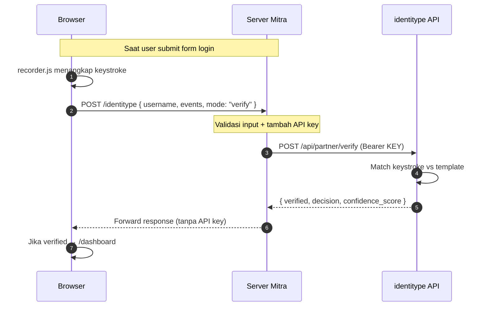

# identitype — Partner Integration Guide

Panduan integrasi API identitype ke website mitra. Ditulis supaya bisa diikuti
dari atas ke bawah tanpa lompat-lompat.

> **Untuk siapa:** developer mitra yang baru pertama kali integrasi.
> **Target waktu:** panggilan API pertama dalam 5 menit, integrasi lengkap dalam ~2 jam.

---

## TL;DR

**identitype** adalah layanan **keystroke biometrics** — selain password, sistem memverifikasi *ritme ketikan* user. User butuh **enroll** (latih model) sebelum bisa **verify** (autentikasi). Semua call ke API harus lewat **server mitra** (proxy), tidak langsung dari browser, karena ada API key.

---

## 1. Quickstart (5 menit)

Buktikan koneksi ke API jalan sebelum tulis kode apa pun.

### Yang perlu disiapkan

- `BASE_URL` dari tim identitype (contoh: `https://api.identitype.example.com/api/partner`)
- `API_KEY` dengan format `sk_live_...` dari tim identitype

### Test koneksi dengan cURL

```bash
curl -X POST <BASE_URL>/enroll \
  -H "Authorization: Bearer <YOUR_API_KEY>" \
  -H "Content-Type: application/json" \
  -d '{
    "username": "test-user-1",
    "events": [
      {"evt":"d","key":"a","code":"KeyA","t":0},
      {"evt":"u","key":"a","code":"KeyA","t":85},
      {"evt":"d","key":"b","code":"KeyB","t":210},
      {"evt":"u","key":"b","code":"KeyB","t":295}
    ]
  }'
```

### Apa yang harus Anda lihat

✅ **Sukses (HTTP 200/201):**
```json
{
  "success": true,
  "message": "Sample 1/10 saved",
  "templates_count": 1,
  "required_templates": 10,
  "progress": { "current": 1, "target": 10 }
}
```
→ Connectivity OK. Lanjut ke Section 2.

❌ **HTTP 401 / `Invalid API key`:**
→ API key salah atau di-revoke. Hubungi tim identitype.

❌ **HTTP 404:**
→ `BASE_URL` salah. Pastikan path-nya `.../api/partner` (bukan `.../api/v1` dll).

❌ **Timeout / Connection refused:**
→ Server identitype tidak bisa dihubungi. Cek firewall/VPN. Untuk dev lokal, tanya tim identitype IP/port yang benar.

❌ **`INVALID_KEYSTROKE_DATA`:**
→ Normal — payload contoh terlalu pendek. Yang penting connectivity sudah jalan.

---

## 2. Gotchas — Baca Dulu Sebelum Coding

Lima hal yang sering bikin developer baru stuck. Pahami sekarang, hemat berjam-jam debug nanti.

### G1 — `events` mengandung password plain-text

Tiap event punya field `key` (`"key": "U"`, `"key": "m"`, dst). Disusun urut, mereka **mengeja literal password user**.

Implikasi:
- ✅ **HTTPS wajib** di kedua hop (browser↔mitra, mitra↔identitype)
- ✅ **Jangan log payload** — log file Anda akan jadi kumpulan password
- ❌ Jangan kirim payload via channel tidak terenkripsi

### G2 — Target perekam **harus sama** antara enroll dan verify

Kalau enrollment merekam keystroke di field `password` saja, login juga **hanya** boleh merekam `password`. Kalau saat verify Anda merekam `email + Tab + password`, model akan reject sebagai impostor.

```javascript
// ✅ Benar — sama di enroll & login
recorder.addTarget("password");

// ❌ Salah — login merekam lebih banyak dari enrollment
recorder.addTarget("email");
recorder.addTarget("password");
```

### G3 — Validasi password sebelum enroll

User bisa mengetik password berbeda saat enrollment. Model jadi belajar ritme password salah → saat login dengan password benar, dianggap impostor.

**Solusi:** sebelum kirim ke `/enroll`, validasi password yang diketik cocok dengan password akun. Lihat [G3 di implementasi](#c2-enrollment).

### G4 — Jangan hardcode `required_templates`

Server menentukan minimum sampel (5? 10? bisa berubah). Selalu **baca dari response**:

```javascript
const need = response.required_templates || response.min_templates;
```

### G5 — API key di server-only, tidak boleh di browser

Kalau key ada di JavaScript browser, siapa pun bisa baca via DevTools, habiskan kuota Anda, dan enroll/verify atas nama Anda.

→ **Semua call ke identitype harus lewat endpoint proxy di backend Anda.**

---

## 3. Arsitektur



**Tiga lapisan, tiga tanggung jawab:**

| Lapisan | Tugas |
|---|---|
| Browser | Merekam keystroke event (recorder.js) dan kirim ke proxy mitra |
| Server Mitra | Validasi input + sisipkan API key + forward ke identitype |
| identitype API | Train (enroll) atau verifikasi (verify) ritme ketikan |

---

## 4. Implementasi

Tiga komponen yang harus Anda bangun. Kode di sini diambil langsung dari simulasi — bisa copy-paste, sesuaikan saja.

### A. Backend — HTTP Client ke identitype

Buat satu file yang membungkus semua call ke identitype. Konfigurasi dari environment variable.

**`identitype.py`** (versi minimum):

```python
import json
import os
import urllib.request, urllib.error

BASE_URL = os.getenv("IDENTITYPE_BASE_URL")
API_KEY  = os.getenv("IDENTITYPE_API_KEY")

def _post(endpoint, payload):
    req = urllib.request.Request(
        f"{BASE_URL}/{endpoint}",
        data=json.dumps(payload).encode("utf-8"),
        method="POST",
        headers={
            "Authorization": f"Bearer {API_KEY}",
            "Content-Type": "application/json",
        },
    )
    try:
        with urllib.request.urlopen(req, timeout=30) as res:
            return json.loads(res.read())
    except urllib.error.HTTPError as e:
        body = json.loads(e.read() or b"{}")
        body["http_status"] = e.code
        return body
    except Exception:
        return {"success": False, "error_code": "SERVICE_UNAVAILABLE"}

def enroll(username, events):
    return _post("enroll", {"username": username, "events": events})

def verify(username, events):
    return _post("verify", {"username": username, "events": events})
```

> **Versi production-ready** ada di [website/identitype.py](../website/identitype.py) — lengkap dengan timeout terpisah, sanitasi pesan error, logging metadata (tanpa payload), dan penanganan timeout/network error secara terpisah.

#### Test cepat dari Python REPL:

```python
>>> import os
>>> os.environ["IDENTITYPE_BASE_URL"] = "https://api.identitype.example.com/api/partner"
>>> os.environ["IDENTITYPE_API_KEY"] = "sk_live_..."
>>> from identitype import enroll
>>> enroll("test-user", [{"evt":"d","key":"a","code":"KeyA","t":0}])
{'success': True, 'templates_count': 1, ...}
```

✅ Kalau dapat `success: True`, lanjut.

---

### B. Backend — Endpoint Proxy

Browser tidak boleh punya API key. Jadi browser kirim ke **endpoint Anda**, server Anda yang panggil identitype.

```python
# views.py
from flask import Blueprint, request, jsonify
from .identitype import enroll, verify

views = Blueprint("views", __name__)

@views.route("/identitype", methods=["POST"])
def identitype_proxy():
    data = request.get_json() or {}
    username = data.get("username")
    events   = data.get("events")
    mode     = data.get("mode", "verify")

    if not username or not isinstance(events, list) or not events:
        return jsonify({"error": "Bad request"}), 400

    result = enroll(username, events) if mode == "enroll" else verify(username, events)
    return jsonify({mode: result}), (200 if result.get("success") else 400)
```

#### Test dari shell:

```bash
curl -X POST http://localhost:5000/identitype \
  -H "Content-Type: application/json" \
  -d '{"username":"test-1","events":[{"evt":"d","key":"a","code":"KeyA","t":0}],"mode":"enroll"}'
```

✅ Harus dapat: `{"enroll": {"success": true, ...}}`.

---

### C. Frontend — Flow Enroll + Verify

Tiga bagian: perekam keystroke, halaman enrollment, halaman login.

#### C.1 Drop-in `recorder.js`

Copy [website/static/recorder.js](../website/static/recorder.js) apa adanya. Vanilla JS, tidak butuh framework.

Cara pakai:

```javascript
import { Keystroke } from "./recorder.js";

const recorder = new Keystroke();
recorder.addTarget("password");   // hanya rekam field ini (lihat G2)

// Saat user submit form:
const events = recorder.getEvents();
recorder.reset();
```

#### C.2 Enrollment

```javascript
async function submitEnrollment(userId, password, events) {
  // ⚠️ G3 — validasi password cocok dengan akun dulu
  const check = await fetch("/api/verify-password", {
    method: "POST",
    headers: { "Content-Type": "application/json" },
    body: JSON.stringify({ user_id: userId, password }),
  }).then(r => r.json());

  if (!check.match) {
    showError("Password tidak cocok dengan akun Anda.");
    return;
  }

  // OK, kirim keystroke
  const res = await fetch("/identitype", {
    method: "POST",
    headers: { "Content-Type": "application/json" },
    body: JSON.stringify({ username: userId, events, mode: "enroll" }),
  });

  const { enroll: data } = await res.json();

  if (data.success) {
    // G4 — baca progress dari response, jangan hardcode
    const current = data.progress?.current ?? data.templates_count;
    const target  = data.progress?.target  ?? data.required_templates;

    if (current >= target) {
      // ✅ Selesai
      window.location.href = "/login";
    } else {
      // Belum cukup, enroll lagi
      showInfo(`Tersimpan ${current}/${target}. Enroll lagi.`);
      window.location.reload();
    }
  } else {
    showError(data.message);
  }
}
```

#### C.3 Login + Verify

```javascript
async function submitLogin(email, password, events) {
  // Step 1: validasi password biasa
  const login = await fetch("/api/login", {
    method: "POST",
    headers: { "Content-Type": "application/json" },
    body: JSON.stringify({ email, password }),
  }).then(r => r.json());

  if (!login.user_id) {
    showError(login.message);
    return;
  }

  // Step 2: verifikasi ritme ketikan
  const res = await fetch("/identitype", {
    method: "POST",
    headers: { "Content-Type": "application/json" },
    body: JSON.stringify({ username: login.user_id, events, mode: "verify" }),
  });

  const { verify: data } = await res.json();

  if (data.success && data.verified && data.decision === "genuine") {
    window.location.href = "/dashboard";
  } else {
    showError("Pola ketikan tidak cocok.");
  }
}
```

#### ✅ Flow lengkap yang harus berhasil:

1. Sign Up → akun dibuat, redirect ke enrollment
2. Enroll 5–10x → progress naik tiap submit → selesai, redirect ke login
3. Login → password OK + ritme ketikan match → redirect ke dashboard

---

## 5. Production Checklist

| Area | Item |
|---|---|
| **Secrets** | API key di env var, bukan source. `.env` di `.gitignore`. |
| **Transport** | HTTPS di browser↔mitra dan mitra↔identitype. |
| **Logging** | Hanya metadata (mode, count, decision). Tidak pernah `print(payload)`. |
| **Auth** | `username` di proxy ambil dari **session server-side**, bukan body request. |
| **Validasi** | Schema check `events` (array, max ~1000 events, max ~256KB body). |
| **Rate limit** | Per-user di sisi mitra (mis. 5 verify/menit), berlapis dengan rate limit identitype. |
| **Lockout** | Setelah N gagal verify berturut-turut, lock akun + email notif. |
| **Privacy** | Disclosure di privacy notice (GDPR Art. 9 / UU PDP) — data biometrik dikirim ke pihak ketiga. |
| **Opt-out** | User bisa pilih tidak pakai keystroke + bisa hapus template. |

---

## 6. Reference

### Environment Variables

| Var | Wajib | Contoh |
|---|---|---|
| `IDENTITYPE_BASE_URL` | ✅ | `https://api.identitype.example.com/api/partner` |
| `IDENTITYPE_API_KEY` | ✅ | `sk_live_...` |
| `IDENTITYPE_TIMEOUT_SECONDS` | optional | `30` |
| `FLASK_SECRET_KEY` | ✅ | (random 32 char) |
| `FLASK_DEBUG` | optional | `0` di production |

### Error Codes

| `error_code` | HTTP | Arti | Aksi yang disarankan |
|---|---|---|---|
| `INVALID_KEYSTROKE_DATA` | 400 | Event terlalu pendek/aneh | Minta user ketik ulang dengan natural |
| `INSUFFICIENT_SAMPLES` / `INSUFFICIENT_ENROLLMENT` | 400 | Belum cukup template | Arahkan kembali ke enrollment |
| `INVALID_USERNAME` | 400 | Username belum terdaftar di identitype | Belum pernah enroll |
| `RATE_LIMIT_EXCEEDED` | 429 | Terlalu banyak request | Backoff + Retry-After header |
| `USER_NOT_FOUND` | 404 | User belum enroll | Redirect ke enrollment |
| `SERVICE_UNAVAILABLE` / `SERVICE_TIMEOUT` | — | Server tidak bisa dihubungi | Toast warning kuning, retry manual |
| `UPSTREAM_ERROR` | 5xx | Server identitype error | Tampilkan generic message |

### Map File di Simulasi

Implementasi nyata dari setiap komponen di atas:

| Komponen | File |
|---|---|
| HTTP client ke identitype | [website/identitype.py](../website/identitype.py) |
| Endpoint proxy `/identitype` | [website/views.py](../website/views.py) |
| Endpoint `/api/verify-password` (G3) | [website/auth.py](../website/auth.py) |
| Model User dengan UUID | [website/models.py](../website/models.py) |
| Perekam keystroke (drop-in) | [website/static/recorder.js](../website/static/recorder.js) |
| Logika frontend (enroll + verify) | [website/static/index.js](../website/static/index.js) |
| Form enrollment | [website/templates/typing_patterns.html](../website/templates/typing_patterns.html) |
| Form login | [website/templates/login.html](../website/templates/login.html) |
| Toast (pengganti `alert`) | [website/static/toast.js](../website/static/toast.js) |
| Setup app + env loading | [main.py](../main.py), [website/__init__.py](../website/__init__.py) |

### Dokumen Terkait

- [API_DOCUMENTATION.md](./API_DOCUMENTATION.md) — request/response per endpoint, lengkap.
- [identitype_Postman_Collection.json](./identitype_Postman_Collection.json) — import ke Postman.
- Branch `vanilla` di repo ini — versi tanpa biometric, sebagai pembanding.

---

## Stuck?

| Gejala | Kemungkinan |
|---|---|
| `key=sk_live_REPL…` di log | `.env` belum di-load, tambah `from dotenv import load_dotenv; load_dotenv()` di `main.py` |
| `Bad request version \x16\x03\x01` di log server | `BASE_URL` pakai `https://` tapi server hanya HTTP. Ganti scheme. |
| `decision: impostor` padahal password benar | Lihat **G2** — target perekam beda antara enroll dan verify |
| Selalu `INSUFFICIENT_SAMPLES` setelah enroll banyak kali | Sample-nya ditolak sebagai "unusable" (ketikan terlalu kacau). Ketik lebih konsisten. |
| Toast pesan double | Form punya listener di button click **dan** form submit — pilih salah satu (submit lebih baik) |
